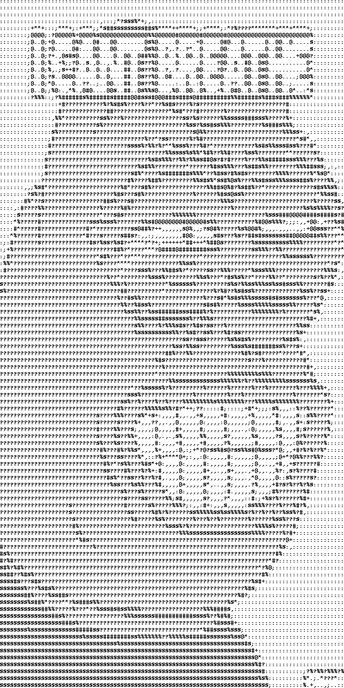

# BfasBot 🔥🤖

A Telegram Selfbot based on [Pyrogram](https://github.com/pyrogram/pyrogram)

## Initial Commands

| Command | Description |
|---|---|
| `.up` - Check if your bot is running
| `.help` - Gives out a link to [all commands](HELP.md)

## Installation

1. `git clone https://github.com/Bfas237/bfasbot`
2. `cd bfasbot`
3. Create a new `.env` file (as [.env.sample](.env.sample))
4. Execute with `python -m bfasbot`
5. Send `.up` in any chat to confirm the userbot is running

## ASCII IMAGE TEST

## Credits

* [Colin Shark](https://git.colinshark.de/PyroBot/PyroBot)
* [Dan Tès](https://github.com/delivrance) for his [Pyrogram Library](https://github.com/pyrogram/pyrogram)
